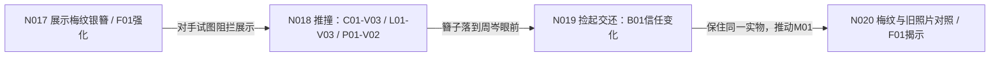

# 填表示例：晚宴礼服、妆发与银簪

以下是原创教学片段，重点展开女主、盟友、宴会厅和银簪的版本关系。剧情语境中的其他人物和物件在真实项目按完整场次另行登记。集号只定位示例，未代表真实项目已完成正文；绑定status均为planned，所有变体均处于“计划／文字设计／r001”，图像与运动样片尚未制作。正式使用时以实际剧本和项目设定替换。

## 故事与身份锚点

C01林晚要在晚宴上替祖母找回被隐瞒的捐赠记录。C02周岑起初只负责维持会场秩序。林晚佩戴祖母留下的银发簪P01，簪首内侧有三点梅纹；旧照片中出现过同一图案，形成F01。两人初次建立信任的支线B01，与查明捐赠记录的主线M01在保全发簪证据时汇合。

- C01：28岁，左眉尾浅痣、身高与肩颈比例固定。三套造型保留这些锚点。
- C02：30岁，右眉短疤、短发，工作人员黑西装与黑领带，全例使用C02-V01。
- L01：同一宴会厅；北侧主台、东门出入、西侧落地窗、南侧酒桌，路线全程稳定。
- P01：同一支银发簪，单股长针，三点梅纹位于簪首内侧。它作装饰插在已由暗夹固定的发髻中；取下时发髻仍能保持。

## 人物变体库（完整有效设定）

| 变体 | 故事时段 | 服装鞋包 | 妆容 | 发型与发饰 | 身体/连续性 | 依据 |
|---|---|---|---|---|---|---|
| C01-V01 | D03上午筹备 | 米色衬衫、深蓝长裤、黑平底鞋、无包 | 薄底妆、自然眉、裸色唇，眼妆完整 | 黑发低马尾、黑发圈；无银簪及其他首饰 | 衣物干净，身体无伤 | EP007-S01进入晚宴准备现场 |
| C01-V02 | D03夜宴事故前 | 藏蓝长袖及踝礼服、黑低跟鞋、无包 | 薄底妆、棕色眼线、豆沙红唇，完整晚宴妆 | 黑发低盘发，暗夹固定；P01-V01插于人物自身左侧后脑；无其他首饰 | 礼服干燥完整，身体无伤 | 晚宴前在场间换装化妆，EP008-S01以动作露出梅纹簪首 |
| C01-V03 | D03事故后 | 同一藏蓝礼服与黑低跟鞋，无包；左袖口湿酒斑 | 同晚宴妆；左眼下有一道擦花的眼线，右眼与唇妆保持 | 同一低盘发，左鬓一缕脱落；暗夹仍固定，银簪已取下；无其他首饰 | 身体无伤；湿斑与花妆跨镜保持 | EP008-S01护住旧照片后擦眼、取簪，再遭推撞 |

C02-V01完整设定：30岁，右眉短疤、黑色短发左分；自然底妆，无彩色眼唇妆；黑西装、白衬衫、黑领带、黑皮鞋；无发饰和首饰，衣物完整干燥、身体无伤；声线与人物底版一致。他在EP009捡簪只改变持物状态，继续复用该造型。

## 场景与道具变体库

| 变体 | 状态与继承 | 不变项 | 变化依据 |
|---|---|---|---|
| L01-V01 | D03上午筹备，窗外白昼；东门开放，花架未布完，南侧酒桌已摆空杯 | 固定布局与门窗位置 | EP007-S01 |
| L01-V02 | D03夜宴，窗外夜色；暖灯开启，花架完成、酒桌杯中有酒，东门保持开放 | 沿用L01布局和酒桌位置 | 筹备完成与日落，有场间时间 |
| L01-V03 | 同夜宴灯光和布置；南侧酒桌向东倾倒，地面酒渍及碎杯 | 北台、东门、西窗保持；东门通路仍可通行 | EP008-S01推撞事故 |
| P01-V01 | 银簪完整干燥，簪首与针身牢固；三点梅纹清晰 | 银色、长度比例、独有梅纹 | 祖母留下的原物，晚宴前被C01佩戴 |
| P01-V02 | 簪首连接处弯裂，仍连在针身上，未分离成两件；三点梅纹完整 | 身份标记与原物一致 | 取下后掉落，被倾倒酒桌桌脚压到 |
| P01-V03 | 簪首连接处修复，有一条细焊痕；梅纹保留 | 同一件原物，无新实物ID | 计划EP012-S01交代修复和取回，至少有一夜处理时间 |

P01所有人始终为C01。持有人与所在位置随剧情单列，避免把“C02捡到簪子”写成“新簪子”。P01-V03是计划状态；未写到修复场时保持计划，后文提前使用会形成连续性问题。

## 逐场绑定

下表每个变体均绑定`@r001`，作为本例的文字设计修订引用。正式制作时每条引用展开为完整ID与r号。

| 集场/动作段 | 故事时间/层 | 人物 | 地点 | 道具与持有位置 | 场末变化 |
|---|---|---|---|---|---|
| EP007-S01 | D03上午/现实 | C01-V01、C02-V01 | L01-V01 | P01未出镜；已有归属记录为C01，暂存在其家中首饰盒 | 准备晚宴，尚无状态损坏 |
| EP008-S01开始 | D03夜/现实 | C01-V02、C02-V01 | L01-V02 | P01-V01佩戴在C01自身左侧后脑 | 以侧后近景展示梅纹，强化F01 |
| EP008-S01取簪 | 同一时刻/现实 | C01-V02进入；C01擦眼、取簪，过渡动作另记 | L01-V02 | P01-V01从发间移到C01右手，簪首朝上 | 发间无银簪，左眼线擦花；中间态按动作连接 |
| EP008-S01推撞后 | 同一时刻/现实 | C01-V03、C02-V01 | L01-V03 | P01-V02在南侧酒桌脚旁；C01失去持有，所有权不变 | 左袖沾酒、左鬓散发；簪首弯裂 |
| EP009-S01捡起并交还 | D03同夜稍后/现实 | C01-V03、C02-V01 | L01-V03 | P01-V02从地面→C02右手→C01右手 | C02保全证物，关系由怀疑转为初步合作 |
| EP010-S01回忆晚宴开始 | 回到D03事故前/回忆 | C01-V02、C02-V01 | L01-V02 | P01-V01仍在C01发间 | 让观众看清当时已有梅纹，保持过去版本 |
| EP010-S02切回现实 | D03同夜、承接EP009/现实 | C01-V03、C02-V01 | L01-V03 | P01-V02留在C01右手 | 使用弯裂但梅纹仍在的实物继续追问 |

EP010-S01→S02是呈现层切换，不是发簪再次损坏或人物瞬间换衣。EP012修复安排独立记录“C01交给修理者→修理者持有→交还C01”；修理者实际入正文时沿用新增人物登记，修复前后本体不变。

## 转换与因果伏笔

| 转换记录 | 前状态→触发→后状态 | 故事依据 | 因果/伏笔作用 |
|---|---|---|---|
| T001 | C01-V01→场间换礼服、晚宴妆和盘发，家中取簪佩戴→C01-V02 | D03上午至入夜间隔 | 适应晚宴场合，给F01明确出场 |
| T002 | L01-V01→完成布置、日落开灯→L01-V02 | 同一场间时间 | 保持宴会厅身份 |
| T003 | C01-V02/P01-V01发间→擦眼、取簪、推撞→C01-V03/P01-V02地面 | N018，EP008-S01 | 对手阻止展示实物，反使簪子暴露于C02眼前 |
| T004 | L01-V02→撞倒南侧酒桌→L01-V03 | 同一N018 | 解释衣物酒斑和道具受压，保留事故痕迹 |
| T005 | P01-V02地面→C02捡起并交还→C01右手 | N019，EP009-S01 | B01关系转变向M01保全证据汇合 |
| T006 | 现实事故后→回忆事故前：C01-V02/L01-V02/P01-V01 | EP010-S01，叙事切换 | F01强化，梅纹是旧照片匹配的识别锚点 |
| T007 | 回忆事故前→现实事故后：C01-V03/L01-V03/P01-V02 | EP010-S02，叙事切换 | 承接EP009实际状态，缺口与弯裂只属于事故之后 |

## 同一变体的制作修订示例

后续若P01-V02@r001参考图错误模糊梅纹，修成r002时保持弯裂程度、材质和三点梅纹原设定，登记“画面识别修正”。列出EP008事故后、EP009与EP010现实段的受影响镜头，迁移并复核；EP010回忆仍引用完整的P01-V01。此处仅示范修订方法，r002素材尚未实际制作。

## 用该例检查连续性

成立：C01礼服换装有场间时间；取簪后发髻由暗夹支撑；花妆和酒斑在当晚延续；破损簪子的物理状态在C02转交时保持；回忆使用事故前版本。

应修复的情况：EP009人物仍佩戴同一银簪；切回现实时妆面恢复；酒桌自动扶正且碎杯消失；发簪弯裂后在修复之前变完好；C02归还时簪首梅纹换成其他图案。这些问题分别回查人物绑定、场景版本、道具转换或技术修订。
