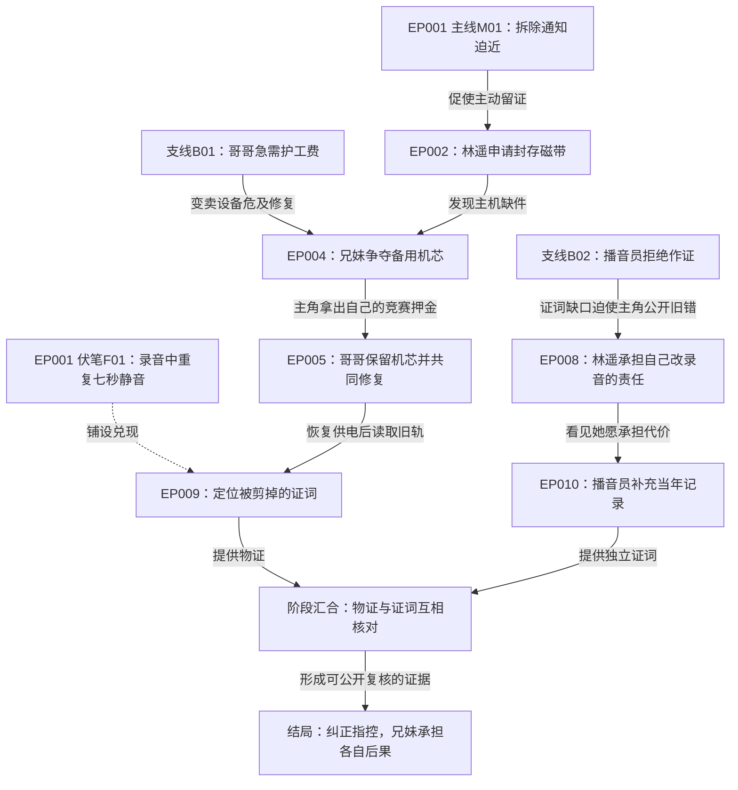

# 贯穿120集的建图方法

## 图中表达什么

**主线**：最终目标、阶段行动、主要阻力、结果与代价，终点落在全剧结局。

**支线**：独立人物的目标和事件链，说明它改变主线的哪种条件。情感支线可通过信任或背叛影响关键选择，未必提供物质证据。

**因果**：前事件使后事件发生、变难、转向或产生新选择。写“因为公开了证据，对手提前转移物件”，避免仅写“然后去下一场”。

**信息**：事实何时发生与观众何时得知分开；每次揭示标知情者变化。

**伏笔**：先前出现的动作、规则、物件、对白或关系承诺在后面获得新含义并影响行动。

## 结构化字段

节点：`id, season_id, episode, global_episode, scene, lane, status, actor, goal, prior_condition, choice, action, result, cost, knowledge_delta, rule_ids, payoff_ids`。

边：`id, from, to, kind, reason, required_fact, evidence, from_season, to_season`。kind取`cause`因果、`enable`使之可行、`obstruct`新增阻力、`setup_payoff`铺设兑现、`information`信息影响；跨季再取`season_bridge`、`carryover`、`reveal`、`consequence`。时间线单列，不以箭头自动认定因果。

主支线：`id, goal, owner, entry_node, turn_nodes, merge_nodes, resolution_node, contribution`。

伏笔：`id, promise, first_node, reinforcement_nodes, misleading_interpretation, reveal_node, payoff_node, consequence_node, actual_evidence, status`。

涉及资产时，节点可追加 `asset_variant_ids, transition_ids`；伏笔可追加 `asset_variant_ids, locked_features`。引用C/L/P-V编号和T编号，锁定特征写明佩戴侧、梅纹、裂口、妆痕或空间条件等实际依据。具体r修订及素材路径维护在制作绑定，避免图里重复设定。普通换装留在资产变更表；改变身份识别、证物或人物选择的变化进入图。人物伪装是否被识破还需符合当时的知情记录。

## 三层视图

1. 系列总览（多季）/全剧总览（单季）：先以季，再以阶段结果为节点，标M/B线路和汇合；让读者看懂上一季为何改变下一季条件。
2. 季内阶段详图：每集一到几个真实事件节点，标前因与后果；颜色/节点前缀区分主线、支线、伏笔。
3. 局部回收图：围绕重要反转或高潮，展开规则、人物选择、证物与信息差，核查必要条件。

图应附节点清单，保证不支持图形的AI仍能读取所有关系。每阶段完成后与完整正文对照；季末将节点、承诺、资源和知情范围封存为交接快照。当总图与文本冲突，以用户已定事实为依据解决并同时更新。

## 原创简例：旧广播站

主线：女维修员林遥在广播站拆除前恢复母亲的原始录音，澄清一次错误指控。

支线B01：哥哥为支付护工费准备卖设备。卖设备会损坏录音恢复条件，两人的目标起初冲突。

支线B02：退休播音员坚持保护当年同事。她的沉默导致证词缺口，后因主角承担公开自身错误的代价而改变立场。

简例展示因果和汇合，实际120集项目逐集展开；图中的未来节点标计划。每个“因为”的逻辑还需要人物动机和现场条件在正文中成立。

## 断链与修订

| 问题 | 修订动作 |
|---|---|
| 事件只有先后，没有依赖 | 让前一次行动改变后一次资源、信息或风险；无作用场景合并 |
| 支线离主线很远且无回流 | 给支线关键选择一个明确汇合结果，或缩减为局部人物戏 |
| 高潮靠临时技能 | 前置建立、尝试和限制，再让主角选择使用方式 |
| 伏笔有揭示无后果 | 让揭示改变行动、关系或代价，完成兑现后的余波 |
| 每次失败都自动清零 | 在资源、声誉、关系或时间账上留下损失 |
| 同一集没有变化节点 | 重写本集目标和行动，或并入相邻集并重排内容 |
| 因果循环 | 区分角色反馈循环与事件时间；A导致B，B的后果导致新的A2，而非同一A |

## 与审稿联动

评分时图形漂亮不等于故事成立。要求随机选择每季中段五集，能沿节点追到前因和后果；从每季高潮倒查关键条件均有建立位置；从开篇正查主要观看承诺均有实际回收位置。多季再从 S02 开篇倒查 S01 交接条件，确认没有“换季清零”。只完成设计的图报告为计划图。
